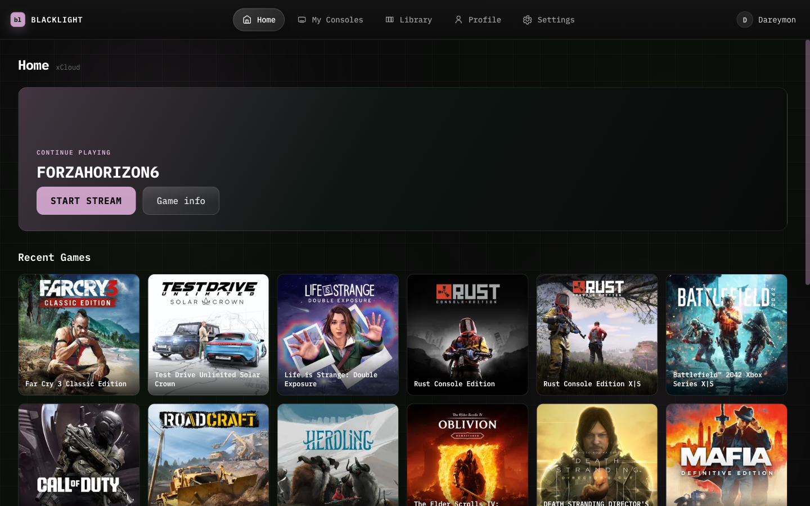
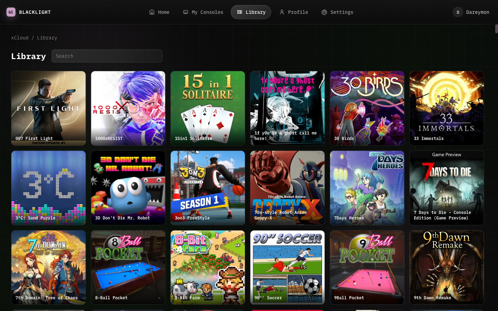

# Blacklight

**Status: Public beta** — macOS, Windows and Linux builds are available; feedback and bug reports are welcome.

**Blacklight** is an independent open-source Xbox streaming tool — xCloud and console home streaming for **macOS**, **Windows** and **Linux** (Tauri). Built with TypeScript; streaming engine powered by [xbox-xcloud-player](https://github.com/unknownskl/xbox-xcloud-player).

**Maintainer:** Igor Samarin ([@isamarin](https://github.com/isamarin)) — <mako.mmw@gmail.com>

**Versioning:** [CalVer](https://calver.org/) (`26.8.N`). Release tags: `v26.8.10`.

_DISCLAIMER: Blacklight is not affiliated with Microsoft, Xbox or Moonlight. All rights and trademarks are property of their respective owners._

## Features

- Stream video and audio from the Xbox One and Xbox Series
- Support for gamepad controls
- Supports rumble on xCloud
- Keyboard controls
- Build-in online friends list

 

## Install

### Download pre-compiled binaries

[Latest releases](https://github.com/isamarin/blacklight/releases)

### Compile from source

See [Local development](#local-development).

## Keyboard controls

Keys are mapped as following by default:

    Dpad: Keypad direction controls
    Buttons: A, B, X, Y, Backspace (Mapped as B), Enter (Mapped as A)
    Nexus (Xbox button): N
    Left Bumper: [
    Right Bumper: ]
    Left Trigger: -
    Right Trigger: =
    View: V
    Menu: M

## Streaming stats

During the stream you can show debug statistics that contain extra data about the buffer queues and other information. To bring this up you can press `~` on your keyboard.

At the bottom-left you can see the status (although not always accurate). At the top-right you can find the FPS of the video and audio decoders including the latency. At the bottom-right you can find debug information about the buffer queues and other information that is useful for debugging perposes.

When possible always provide this information with your issue, if it is related.

## Online friends list

The application also provides a way to see which of your friends are online. This can be useful when you want to quickly check if anyone is online to play with :)

## Local Development

### Requirements

- Node.js ([https://nodejs.org/](https://nodejs.org/))
- pnpm ([https://pnpm.io/](https://pnpm.io/))
- Rust toolchain (for Tauri desktop builds)
- On Linux: the Tauri v2 system dependencies (`libwebkit2gtk-4.1-dev`,
  `libayatana-appindicator3-dev`, `librsvg2-dev`, `libxdo-dev`, `patchelf`,
  and `rpm` if you want an RPM) — see the Linux step in
  `.github/workflows/build.yml` for the exact package list

### Steps to get up and running

Clone the repository:

    git clone https://github.com/isamarin/blacklight.git
    cd blacklight

Install dependencies:

    pnpm install

Run development build:

    pnpm desktop-tauri tauri:dev

Create production build:

    pnpm desktop-tauri tauri:build

Release tag (triggers a CI draft release with installers for every platform):

    git tag -a v26.8.10 -m "Blacklight 26.8.10"
    git push origin v26.8.10

The `tauri_desktop` matrix in `.github/workflows/build.yml` builds each target on
its own native runner and attaches the results to the draft release:

| Platform | Runner | Installers |
| --- | --- | --- |
| macOS (Apple Silicon) | `macos-latest` | `.dmg` |
| macOS (Intel) | `macos-13` | `.dmg` |
| Windows (x64) | `windows-latest` | `.exe` (NSIS) |
| Linux (x64) | `ubuntu-22.04` | `.deb`, `.rpm`, `.AppImage` |

Typecheck the Tauri UI:

    pnpm check:tauri

Run the workspace test suite (desktop-tauri, pages):

    pnpm test

Run auth/stream smoke against a local API + built UI (also used in CI):

    pnpm smoke:e2e

## Translations

Want to help with translations? Open an [issue](https://github.com/isamarin/blacklight/issues) or submit a PR with updated locale files.

## License

Blacklight is licensed under the [PolyForm Noncommercial License 1.0.0](https://polyformproject.org/licenses/noncommercial/1.0.0). You may use, modify, and distribute the software for **noncommercial** purposes only. Commercial use (including selling, sublicensing for profit, or using the software in a commercial product or service) is not permitted without separate permission from the copyright holders.

See [LICENSE](LICENSE) for the full text.

## Changelog

See [CHANGELOG.md](CHANGELOG.md)
